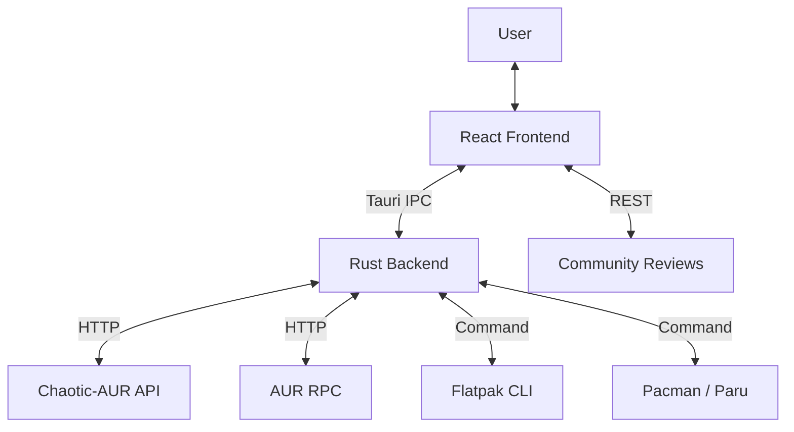

# 🏗️ MonARCH Store Architecture

**Current Version:** v0.4.0-alpha

## Core Philosophy: "Host-Adaptive & Universal"

MonARCH Store v0.4.0 represents a paradigm shift from "opinionated distribution management" to **Host-Adaptive Architecture**. The application no longer attempts to force a specific repository configuration (like Soft Disable) but instead respects the host system's `pacman.conf` and `flatpak` configuration as the source of truth.

## 1. High-Level Overview

## 2. The Host-Adaptive Repository Layer
**Module:** `repo_manager.rs`

Instead of managing a private database of enabled/disabled repos, MonARCH now uses ALPM (Arch Linux Package Management) to inspect the system state:
*   **Discovery Mode**: At startup, we read ALPM to see which repositories are *actually* enabled (`cachyos`, `garuda`, `multilib`).
*   **Safety Guard**: We do not allow enabling `chaotic-aur` on Manjaro systems to prevent glibc incompatibility.
*   **Result**: If you enable a repo in `/etc/pacman.conf` manually, MonARCH sees it. If you use our toggle, we write a drop-in file to `/etc/pacman.d/monarch/`.

## 2. Unified Search Aggregator
**Module:** `search.rs`

The search engine now operates as a parallel aggregator:

1.  **Frontend Request**: User types "firefox".
2.  **Parallel Dispatch**: `tokio::join!` launches three concurrent tasks:
    *   **ALPM/Repo**: Queries local sync databases for official packages.
    *   **Flathub**: specific CLI/API search for Flatpaks.
    *   **AUR**: Web query to the AUR RPC interface.
3.  **Normalization & Merging**: 
    *   Results are normalized (to lowercase) and keyed by name.
    *   **Priority Merge**: Official packages overwrite Flatpaks, which overwrite AUR.
    *   **Source Tracking**: A single `Package` struct now contains `available_sources: ["official", "flatpak", "aur"]`, allowing the UI to present a simple "Source" selector dropdown.

## 3. Native Integration Layers

### 📦 Flatpak (The Safety Net)
**Module:** `flathub_api.rs`
*   **Integration**: Direct wrapper around the `flatpak` CLI.
*   **Scope**: User-level operations (`flatpak install --user`) where possible to avoid sudo, or system-level with Polkit.
*   **Use Case**: Proprietary apps (Spotify, Discord) and sandboxed environments.

### 🛠️ Native AUR Builder
**Module:** `aur_api.rs`
*   **Cloning**: Uses `git2` (libgit2 bindings) for high-performance, native git operations.
*   **Building**:
    1.  **Preparation**: Clones to `~/.cache/monarch/aur/<pkg>`.
    2.  **Inspection**: Parses `.SRCINFO` for dependencies and keys.
    3.  **Key Import**: Auto-fetches GPG keys (`gpg --recv-keys`).
    4.  ** Compilation**: Spawns `makepkg` as the **current user** (not root).
    5.  **Streaming**: Real-time log output is streamed via Tauri Events (`hurd://log`) to the frontend console.
    6.  **Installation**: Final `.pkg.tar.zst` is installed via the `monarch-helper` (Root/Polkit).

## 4. The Installation Pipeline (Iron Core)

All system modifications pass through a strict gatekeeper:

*   **GUI (User)**: Prepares the intent (JSON).
*   **Monarch-Helper (Root)**: Invoked via `pkexec`.
*   **Atomic Transactions**: 
    *   Standard Installs: `pacman -Syu --needed <pkg>` (Prevents partial upgrades).
    *   System Update: `pacman -Syu`.
    *   Lock Guard: Checks `/var/lib/pacman/db.lck`.

## 5. Unified Update System (Operation "Unified State")
**Modules:** `commands/update.rs`, `transactions.rs`

*   **Aggregator**: Parallel `check_updates` fetches from all 3 sources simultaneously.
*   **Execution Engine**: `apply_updates` enforces the **Safety Lock**:
    > If ANY official package needs updating, the entire batch runs as a system upgrade (`-Syu`), ensuring consistency.

### 🔐 Operation "Silent Guard" (Permission Aggregation)
To solve the "password fatigue" problem (multiple prompts for one action):
1.  **Protocol**: Frontend sends a `TransactionManifest` (Refresh + Upgrade + Remove + Install) as one packet.
2.  **Helper**: Acquires the ALPM lock once and executes all steps in sequence.
3.  **Policy**: Polkit rule `auth_admin_keep` remembers the password for 5 minutes for `com.monarch.store.batch`.

## 6. Frontend Stack (The Chameleon)
**Tech**: React 19, TypeScript, Tailwind 4.

*   **Theme Detection**: Uses **XDG Desktop Portals** to detect Dark/Light mode on any desktop (GNOME, KDE, Hyprland).
*   **Wayland Detection**: Adjusts window rendering strategies (flicker prevention) if `WAYLAND_DISPLAY` is present.
