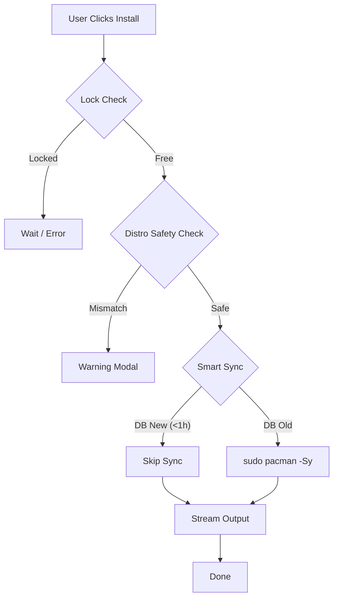

# 🏗️ MonARCH Store Architecture

## Core Philosophy: "Safe by Default, Powerful by Choice"

MonARCH Store is designed to solve the "Split-Brain" problem common in Arch Linux GUI store wrappers, where the GUI database falls out of sync with the system database, causing partial upgrade failures.

## 1. The "Soft Disable" Repository Model

Unlike standard managers that edit `/etc/pacman.conf` to remove repositories, MonARCH uses a **Soft Disable** approach:

*   **System State (True)**: All supported repositories (`chaotic-aur`, `cachyos`, `garuda`, `multilib`) are **permanently enabled** in `/etc/pacman.d/monarch_repos.conf` upon onboarding.
*   **User View (Virtual)**: When a user "disables" a repo in the UI, MonARCH simply filters those packages from search results and browsing.
*   **Benefit**: System updates (`pacman -Syu`) see *all* repositories, ensuring shared libraries (`glibc`, `openssl`) are updated atomically across the entire system, preventing breakage.

## 2. "Chaotic-First" Installation Pipeline

To provide a "Store-like" instant experience, MonARCH prioritizes pre-built binaries over source compilations:

1.  **Repo 0: Hardware Optimized** (CachyOS-v3/v4). If the user's CPU supports AVX2/AVX-512, these packages are ranked #0.
2.  **Repo 1: Chaotic-AUR**. The largest pre-compiled binary repo for AUR packages. Ranked #1.
3.  **Repo 2: Official Arch**. Standard stable packages. Ranked #2.
4.  **Repo 3: AUR**. Source builds. Ranked #3 (Last Resort).

This ensures that clicking "Install" almost always results in a fast, binary download rather than a slow `makepkg` compilation.

## 2. The "Butterfly" Engine (Distro-Awareness)

MonARCH is **Context-Aware** thanks to the `distro_detect.rs` module. It probes `/etc/os-release` at startup to build an `IdentityMatrix`:

*   **IS_MANJARO**: Activates "Stability Guard" (Hide Chaotic-AUR, Warn on AUR).
*   **IS_ARCH**: Activates "Power User Mode" (Enable all repos, assume base-devel).
*   **IS_CACHYOS**: Activates "Speed Mode" (Prioritize v3/v4 repos).

## 3. The Installer Pipeline (v0.3.00)

The installation flow has been hardened to prevent "partial upgrades" and "split-brain" states:

### 4. Butterfly System Health (v0.3.00 "Butterfly" Overhaul)
MonARCH includes a permission-aware health monitoring ecosystem:
*   **Butterfly Probes**: Verifies `pkexec`, `git`, and `polkit` health at startup to prevent silent failures.
*   **Parallel ODRS Integration**: Ratings are now fetched concurrently during onboarding/home view for 2-3x speed improvements.
*   **Permission-Safe Sensors**: Health checks are now non-privileged, preventing false "Corrupted Keyring" warnings.
*   **Unified Repair Wizard**: A single authorized maintenance flow for Keyring, Security Polices, and Repo sync.

### 5. Frontend Stack: The "Luminosity" Design

The UI has been rewritten using a performance-first, glassmorphic architecture:

*   **Layout Engine**: `PackageDetailsFresh.tsx` uses CSS Grid/Flexbox to create responsive, high-density layouts that adapt to mobile/desktop.
*   **Visuals**: Heavy use of `backdrop-blur`, semi-transparent layers, and "Ghost Text" for a premium feel.
*   **Components**: Atomic design with `PackageCard.tsx` handling its own state (hover, install status) to prevent global re-renders.

## 6. Linux Native Integration

*   **Icons**: Uses standard XDG paths (`/usr/share/icons/...`) resolved via `file://` protocol.
*   **Polkit**: Uses `pkexec` for granular permission escalation (no global sudo usage).
*   **AppStream**: Integrates native metadata for rich descriptions and screenshots.
