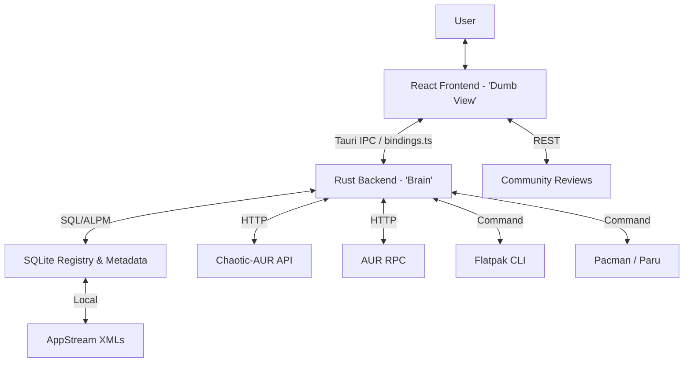

# 🏗️ MonARCH Store Architecture

**Current Version:** v0.4.6-alpha  
**Last updated:** 2026-02-14

## Core Philosophy: "Host-Adaptive & Dumb View"

MonARCH Store v0.4.0+ represents a paradigm shift to **Host-Adaptive Architecture** and **Dumb View Frontend**. 
1. **Host-Adaptive**: The backend respects the host system's `pacman.conf` and `flatpak` configuration as the single source of truth.
2. **Dumb View**: The frontend no longer manages data "pre-warming", metadata guesswork, or complex hydration. It relies on the Rust backend to provide fully-enriched **ViewModel** objects via `bindings.ts`.

## 1. High-Level Overview

```mermaid
graph TD
    User[User] <--> Frontend[React Frontend - 'Dumb View']
    Frontend <-->|Tauri IPC / bindings.ts| Backend[Rust Backend - 'Brain']
    Backend <-->|SQL/ALPM| Registry[SQLite Registry & Metadata]
    Registry <-->|Local| AppStream[AppStream XMLs]
    Backend <-->|HTTP| ChaoticAPI[Chaotic-AUR API]
    Backend <-->|HTTP| AURAPI[AUR RPC]
    Backend <-->|Command| Flatpak[Flatpak CLI]
    Backend <-->|Command| Pacman[Pacman / Paru]
    Frontend <-->|REST| Supabase[Community Reviews]
```

## 2. The Host-Adaptive Repository Layer
**Module:** `repo_manager.rs`

Instead of managing a private database of enabled/disabled repos, MonARCH now uses ALPM (Arch Linux Package Management) to inspect the system state:
*   **Discovery Mode**: At startup, we read ALPM to see which repositories are *actually* enabled (`cachyos`, `garuda`, `multilib`).
*   **Safety Guard**: We do not allow enabling `chaotic-aur` on Manjaro systems to prevent glibc incompatibility.
*   **Distro detection:** We treat `ID=archlinux` as Arch and parse `ID_LIKE`: if it contains `arch` (e.g. ArcoLinux, Archcraft), the distro gets Arch-like capabilities. See `distro_context.rs`.
*   **Result**: If you enable a repo in `/etc/pacman.conf` manually, MonARCH sees it. If you use our toggle, we write a drop-in file to `/etc/pacman.d/monarch/`.

### Chaotic-AUR Safe Toggle (Operation Chaotic Good)
We follow a **read-only host policy**: we do **not** programmatically edit `/etc/pacman.conf`. For Chaotic-AUR:
*   **Check status**: `check_chaotic_status()` returns compatibility (blocked on Manjaro) and whether Chaotic-AUR is present in ALPM syncdbs.
*   **Prepare components**: `prepare_chaotic_components()` invokes the Helper to install the Chaotic keyring and mirrorlist (`pacman -U --noconfirm`). The user must add the repo block to `/etc/pacman.conf` manually; Settings and Onboarding show a "Final Step" modal with the snippet and "Copy to Clipboard" / "Check Again".
*   **Traffic light UX**: Settings → Sources shows Chaotic-AUR as Active / Inactive / Blocked. Package cards and details show "Configure Source" when the only source is Chaotic-AUR and it is not enabled.

### CachyOS: Best repo for the user’s CPU
CachyOS provides CPU-optimized repos (e.g. x86-64-v3, x86-64-v4, Znver4). MonARCH respects the system’s choice and avoids enabling tiers the CPU cannot use:
*   **Discovery:** Repos are read from `/etc/pacman.conf` (e.g. `cachyos-v4`, `cachyos-core-v4`, `cachyos-extra-v4`). Whatever CachyOS or the user enabled is what we see.
*   **Smart enable (Settings):** When the user turns on the “CachyOS” repo family, we only enable repos that match the current CPU: `-znver4` → enable only if Znver4-compatible; `-v4` → only if x86-64-v4; `-v3` / `-core` → only if x86-64-v3. So we never enable a v4 repo on a v3-only machine.
*   **Package ranking:** When resolving which repo provides a package, we rank by CPU tier (`repo_manager.get_all_packages_with_repos`): Znver4-compatible repos first, then v4, then v3, so the UI and install prefer the best tier the CPU supports.
*   **Install:** We install from the repo that has the package (including fallback across all syncdbs if a single-repo lookup fails). No extra CPU logic in the helper—we use the enabled repos and prefer the same ranking as the UI.
*   **CPU detection:** `utils::is_cpu_v3_compatible`, `is_cpu_v4_compatible`, `is_cpu_znver4_compatible` (used by Settings and ranking). System info shows the detected tier (e.g. “x86-64-v4 (AVX-512)”).

## 2. Unified Search Aggregator
**Module:** `search.rs` (Commands), `middleware/aggregation.rs` (Logic)

The search engine now operates as a parallel aggregator (orchestrated by `middleware/aggregation.rs`):

1.  **Frontend Request**: User types "firefox".
2.  **Parallel Dispatch**: `tokio::join!` launches three concurrent tasks:
    *   **ALPM/Repo**: Queries local sync databases for official packages.
    *   **Flathub**: specific CLI/API search for Flatpaks.
    *   **AUR**: Web query to the AUR RPC interface.
3.  **Normalization & Merging**: 
    *   Results are keyed by **canonical merge key** (`utils::canonical_merge_key`): app_id via known map + **first-segment rule** for multi-segment names (e.g. `heroic-games-launcher` and `heroic` → key `heroic`) so one app = one entry without a per-app alias list. Variant suffixes (`-git`, `-bin`) are stripped; then first segment is used when valid.
    *   **Priority Merge**: Official packages overwrite Flatpaks, which overwrite AUR.
    *   **Source Tracking**: A single `Package` struct contains `available_sources`; the UI shows a "best" source badge and source selector (Unified Pipeline). Friendly labels come from `labels::get_friendly_label` (distro-aware). **Display names:** After dedup, every package gets a proper name via `preferred_display_name(canonical_id)` or `to_pretty_name(name)` so one app shows one label (e.g. "Heroic Game Launcher"). See `docs/UNIVERSAL_DATA_ENGINE.md`.

## 3. Native Integration Layers

### 📦 Flatpak (The Safety Net)
**Module:** `flathub_api.rs`
*   **Integration**: Direct wrapper around the `flatpak` CLI.
*   **Scope**: User-level operations (`flatpak install --user`) where possible to avoid sudo, or system-level with Polkit.
*   **Use Case**: Proprietary apps (Spotify, Discord) and sandboxed environments.

### 🛠️ Native AUR Builder
**Module:** `aur_api.rs`
*   **Cloning**: Uses `git2` (libgit2 bindings) for high-performance, native git operations.
*   **Building**:
    1.  **Preparation**: Clones to `~/.cache/monarch/aur/<pkg>`.
    2.  **Inspection**: Parses `.SRCINFO` for dependencies and keys.
    3.  **Key Import**: Auto-fetches GPG keys (`gpg --recv-keys`).
    4.  ** Compilation**: Spawns `makepkg` as the **current user** (not root).
    5.  **Streaming**: Real-time log output is streamed via Tauri Events (`hurd://log`) to the frontend console.
    6.  **Installation**: Final `.pkg.tar.zst` is installed via the `monarch-helper` (Root/Polkit).

## 4. The Installation Pipeline (Iron Core & Safe Guard)

All system modifications pass through a strict gatekeeper:

*   **GUI (User)**: Prepares the intent (JSON).
*   **Monarch-Helper (Root)**: Invoked via **Polkit (`pkexec`)** or **`sudo -S`** depending on Settings: when **Reduce password prompts** is on, the app uses a single branded password dialog per session and runs the Helper with `sudo -S`; when off, the Helper is always run with `pkexec` so the user gets the system auth dialog every time. See `helper_client::invoke_helper(..., use_branded_auth)` and `docs/RECENT_CHANGES.md` §8.
*   **Atomic Transactions**: 
    *   Standard Installs: `pacman -Syu --needed <pkg>` (Prevents partial upgrades).
    *   System Update: `pacman -Syu`.
    *   Lock Guard: Checks `/var/lib/pacman/db.lck`.
*   **Safe Guard (Install & Update)**:
    *   **IgnorePkg**: The helper respects host `IgnorePkg`/`IgnoreGroup` (question callback skips install for ignored packages).
    *   **Update-before-install**: `update_and_install_package` runs a full system upgrade (ExecuteBatch with refresh + upgrade) **before** installing the target package.
    *   **No silent full upgrade**: If an install fails due to stale DB, the GUI emits `failed_update_required` and returns an error—user must explicitly confirm a system upgrade.

## 5. Unified Update System (Operation "Unified State")
**Modules:** `commands/update.rs`, `transactions.rs`

*   **Aggregator**: Parallel `check_updates` fetches from all 3 sources simultaneously.
*   **Execution Engine**: `apply_updates` enforces the **Safety Lock**:
    > If ANY official package needs updating, the entire batch runs as a system upgrade (`-Syu`), ensuring consistency.

### 🔐 Operation "Silent Guard" (Permission Aggregation)
To solve the "password fatigue" problem (multiple prompts for one action):
1.  **Protocol**: Frontend sends a `TransactionManifest` (Refresh + Upgrade + Remove + Install) as one packet.
2.  **Helper**: Acquires the ALPM lock once and executes all steps in sequence.
3.  **Policy**: Polkit rule `auth_admin_keep` remembers the password for 5 minutes for `com.monarch.store.batch`.

## 6. Frontend Stack (The Chameleon & Liquid UI)
**Tech**: React 19, TypeScript, Tailwind 4.

*   **Onboarding Wizard**: Multi-step flow (Welcome → Source Manager → Chaotic-AUR Setup [conditional] → Security & Privacy → Theme → Confirmation). Chaotic-AUR step appears only when the distro is compatible; "Install Keys & Mirrors" opens the same "Final Step" modal as Settings (pacman.conf snippet, Copy, Check Again).
*   **Theme Detection**: Uses **XDG Desktop Portals** to detect Dark/Light mode on any desktop (GNOME, KDE, Hyprland).
*   **Wayland Detection**: Adjusts window rendering strategies (flicker prevention) if `WAYLAND_DISPLAY` is present.
*   **Liquid UI (Responsive)**:
    *   **Window**: Minimum size 800×600 (tauri.conf.json).
    *   **Grids**: Browse, Search, Category, and Trending use responsive columns (`grid-cols-1 md:grid-cols-2 lg:grid-cols-3 xl:grid-cols-4`).
    *   **Mobile**: Bottom navigation bar (`MobileNav`) on small screens; sidebar hidden or collapsed on medium; main content has bottom padding on mobile.
    *   **Package Details**: Header and actions stack on narrow viewports (`flex-col lg:flex-row`); description and actions are centered on small screens.
