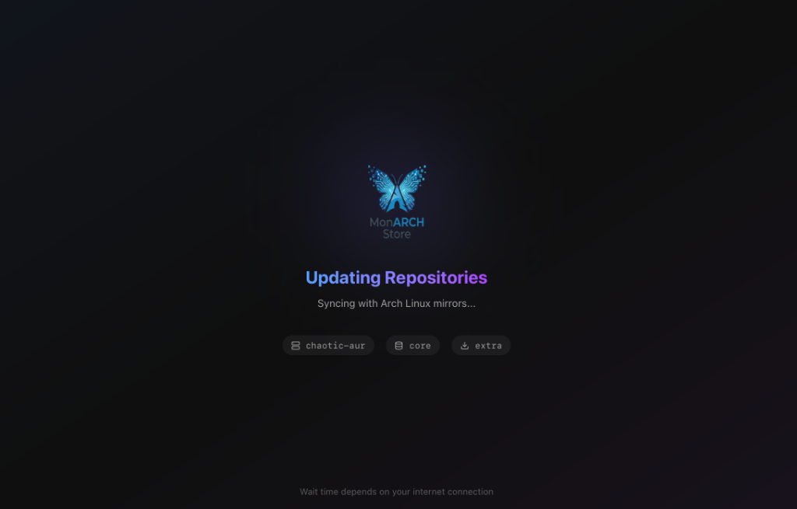

# 🦋 MonARCH Store

**A modern, premium software store for Arch Linux, built with Tauri v2, React, and Rust.**

MonARCH Store is designed to make package management on Arch-based systems (Arch, EndeavourOS, CachyOS, Garuda, etc.) beautiful, fast, and accessible. It unifies **Official Distribution Repositories**, **AUR**, and **Chaotic-AUR** into a single, cohesive experience.


## 📸 Gallery

<p align="center">
  
  
</p>
<p align="center">
  
  
</p>

## ✨ Features

### ⚡ Instant Downloads (Chaotic-First)
We prioritized speed above all else. MonARCH automatically detects if a package has a pre-built binary in **Chaotic-AUR** or **CachyOS** and serves that instead of forcing you to compile from source.
*   **Zero-Compile Updates**: Get AUR packages in seconds, not hours.
*   **Transparent**: You can always choose to "Build from Source" via the dropdown if you prefer.

### 🚀 Hardware Optimization ("God Tier")
MonARCH detects your CPU capabilities (AVX2, AVX-512) and automatically prioritizes **CachyOS v3/v4** repositories if available.
*   **10-20% Faster**: Python, compilers, and rendering apps run significantly faster.
*   **Automatic**: No configuration needed. If your CPU supports it, we use it.

### 🩺 Hardened System Health
MonARCH v0.2.30 introduces a robust, permission-safe health monitoring system:
*   **Sequential Startup**: Intelligent initialization that fixes the system *before* you enter the store.
*   **AMD-Aware Optimization**: Correctly detects CPU feature sets (ABM/LZCNT) for Zen 4/5 architectures.
*   **Unified Maintenance Wizard**: A single "God Mode" repair engine for Keyring, Security Policies, and Repository synchronization.

### 🛡️ Smart Repository Management
*   **Soft Disable Architecture**: Disabling a repo hides clutter but keeps system updates secure in the background.
*   **Chaotic Binary Support**: Native integration with Chaotic-AUR and CachyOS.
*   **Zero-Compile Experience**: Prioritizes pre-built binaries to save time and battery.

### 🧠 Intelligent Package Merging
Stop guessing which "firefox" is the right one. MonARCH intelligently merges results from all sources into a single, clean view.
*   **Unified Search**: Official, Chaotic, and AUR results in one card.
*   **De-Duplication**: We show you the *best* version by default.

### 🛡️ Safety First
*   **Split-Brain Protection**: We check `pacman -Si` before every install to prevent partial upgrades.
*   **GPG Automator**: Missing keys are imported automatically during install.
*   **PKGBUILD Inspector**: Review build scripts before installing from AUR.

### ⚙️ Repository Configuration
You can personalize your store experience by toggling specific repositories (CachyOS, Manjaro, Chaotic-AUR) in the settings. MonArch uses a **"Soft Disable"** architecture: disabling a repository hides it from search but keeps it active in the background for system updates, ensuring your installed apps always remain secure and up-to-date.

## 📘 Documentation
- [Troubleshooting Guide](docs/TROUBLESHOOTING.md) - Fix GPG, Lock files, and Database issues.
- [Security Policy](SECURITY.md) - How to report vulnerabilities.
- [Architecture](docs/ARCHITECTURE.md) - Technical design.

## 🚀 Installation

### Option 1: Pre-built Binary (Recommended)
Download the latest `monarch-store-0.2.40-x86_64.pkg.tar.zst` from the [Releases Page](https://github.com/cpg716/monarch-store/releases).

```bash
sudo pacman -U monarch-store-0.2.40-x86_64.pkg.tar.zst
```

### Option 2: Build from Source
```bash
git clone https://github.com/cpg716/monarch-store.git
cd monarch-store
npm install
npm run tauri build
```

### 🛟 Troubleshooting

If you encounter build errors on Arch Linux (e.g., `failed to run cargo metadata`), use our included fix script to verify your environment:

```bash
git pull origin main
chmod +x arch_fix.sh
./arch_fix.sh
```
This script installs missing build dependencies (like `webkit2gtk`) and cleans stale build artifacts.


## 🤝 Contributing

We welcome contributions! Please follow the standard fork-and-pull request workflow.

*   **Frontend**: React, TailwindCSS, Framer Motion.
*   **Backend**: Rust (Tauri commands).

## 📄 License
MIT License.
