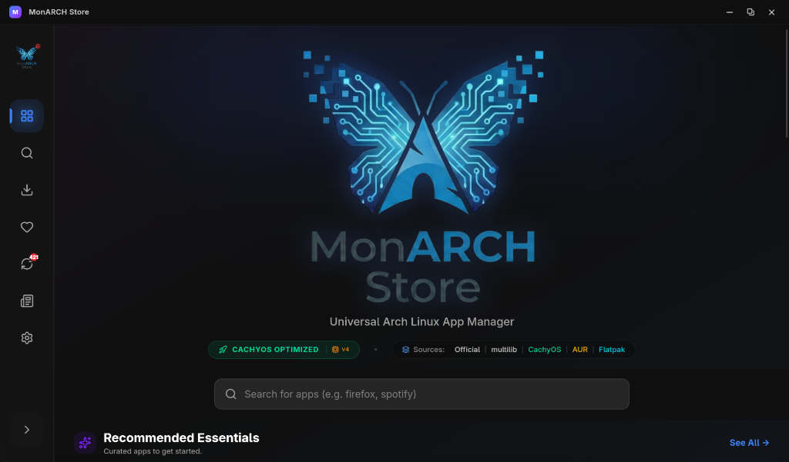

# MonARCH Store: Universal Arch Linux App Manager
> **The Host-Adaptive App Manager for Arch, Manjaro, Garuda, and CachyOS.**

**Author:** [cpg716](https://github.com/cpg716) — developer and creator of MonARCH Store, with the help of AI coding tools.

**Current Version:** v0.4.6-alpha  
**Last updated:** 2026-02-14

## ⚠️ Alpha Disclaimer

**MonARCH Store is currently in ALPHA.** 
While the browsing and Flatpak features are robust, the **system package management is powerful and should be used with care.**

> [!WARNING]
> Use this software with caution on production systems. Always ensure you have a backup of your important data.

---

A premium, universal software center built with Tauri and React. MonARCH **respects your existing system configuration** (Host-Adaptive) while providing a unified interface for Official, AUR, and Flatpak applications.



## ✨ Key Features (v0.4.6)

### 🦎 Host-Adaptive Architecture (v0.4.6-alpha)
MonARCH no longer "injects" its own opinions into your system. **No manual repo configuration required** — we discover repositories from your system.
*   **Respects `pacman.conf`**: We typically only show repositories you have explicitly enabled on your host system.
*   **Manjaro Guard**: Automatically prevents enabling incompatible repositories (like `chaotic-aur`) on Manjaro systems to ensure stability.
*   **Discovery Mode**: Automatically detects CachyOS, Garuda, or EndeavourOS specific repositories and displays them correctly.

### 🛡️ Iron Core Purge (v0.4.6-alpha)
A hardened Single Source of Truth implementation that offloads logic to the backend.
*   **Dumb View Frontend**: The UI only renders data; all complex metadata hydration and normalization happens in the Rust backend for maximum performance.
*   **Zero-Blink Registry**: SQLite-backed registry handles thousands of packages with stable references, preventing flickering during background syncs.
*   **Typed Bindings**: Type-safe contract between Rust and TypeScript via `tauri-specta`, eliminating interface drift.

### 📦 Unified Search & Aggregation
Stop searching three different websites. MonARCH combines them all:
*   **One Search Bar**: Queries **Official Repos**, **AUR**, and **Flathub** simultaneously.
*   **Source Priority**: Intelligently ranks results (Official > Flatpak > AUR).
*   **Smart Merging**: Duplicate apps are merged into a single card with a "Source" selector using a generic first-segment canonical key (e.g., `heroic` merges with `heroic-games-launcher`).
*   **One Proper Name**: Apps use consistent, human-friendly display names (e.g., "Discord" instead of "com.discordapp.Discord").

### 🛠️ Native AUR Builder
A robust, safe implementation of the Arch User Repository.
*   **Built from Source**: Clearly identifies AUR packages that require local compilation.
*   **Native Cloning**: Uses `libgit2` (native) for fast, reliable cloning of AUR packages.
*   **User-Level Builds**: Runs `makepkg` as your user (never root) for security.
*   **Live Logs**: Streams real-time build logs to the UI so you can see exactly what's happening.

### 📦 Full Flatpak Support
The ultimate safety net.
*   **Unified Updates**: Flatpaks are now first-class citizens in the update engine.
*   **Sandboxed**: Perfect for proprietary apps like Discord, Spotify, or Zoom.
*   **Visual Integration**: Flatpaks appear seamlessly alongside native apps.

### 🔄 Unified Update System (The Apdatifier Core)
No more individual updates.
*   **Parallel Aggregation**: Checks for updates from Official Repos, AUR, and Flatpak simultaneously.
*   **Safety Lock**: If any official package is selected, a full system upgrade (`-Syu`) is enforced to prevent partial upgrades.
*   **Update-Before-Install**: Installing a repo package runs a full system upgrade first, then installs the target—no partial upgrades.
*   **Built from Source Indicators**: AUR packages are clearly marked with their build status.

### 🛡️ Safe Guard (Install & Update)
*   **IgnorePkg Respect**: The helper honors your host `IgnorePkg`/`IgnoreGroup`; it never overrides them.
*   **No Silent Full Upgrade**: If an install fails due to stale databases, you are prompted to run a system upgrade explicitly—we do not auto-trigger it in the background.

### 🛸 Mission Control (Settings Redesign)
A completely overhauled settings experience.
*   **Tabbed Layout**: Dedicated sections for Sources, Builder, and Maintenance.
*   **Chaotic-AUR Safe Toggle**: Chaotic-AUR status (Active/Inactive/Blocked); we install keyring and mirrorlist only—you add the repo to pacman.conf manually. Onboarding wizard guides first-time setup (Welcome → Sources → Chaotic-AUR [conditional] → Security & Theme → Confirmation).
*   **Advanced AUR Controls**: Fine-tune parallel downloads, build directory cleaning, and verbose logging.
*   **Diagnostics**: Integrated system health checks and repair tools.

### 🩺 System Health & Safety
*   **Legacy Audit**: Entire codebase sanitized of "Ghost Commands" for absolute stability.
*   **Atomic Updates**: Repo installs use safe transaction barriers (`pacman -Syu --needed`).
*   **Lock Guard**: Prevents operations when the Pacman DB is locked.

### 📱 Liquid UI (Responsive)
*   **Minimum Window Size**: 800×600 to keep layouts readable.
*   **Responsive Grids**: Browse, Search, and Category views use adaptive columns (1–4) across breakpoints.
*   **Mobile Navigation**: Bottom nav bar on small screens; sidebar hidden or collapsed on medium.
*   **Responsive Details**: Package details page stacks header and actions on narrow viewports.

## 📘 Documentation
- [**User Guide**](USER_GUIDE.md) - How to use MonARCH and how it works.
- [**FAQ**](FAQ.md) - Frequently asked questions.
- [**Roadmap**](ROADMAP.md) - Future plans and upcoming features.
- [**Architecture & Design**](ARCHITECTURE.md) - Deep dive into the Host-Adaptive model.
- [**Recent Changes**](docs/RECENT_CHANGES.md) - Summary of unification, Chaotic Good, onboarding, and UI fixes.
- [**Developer Guide**](docs/DEVELOPER.md) - Setup and contribution guide.
- [**Security Policy**](SECURITY.md) - Our security commitments.

## 🚀 Installation

### Option 1: Pre-built Binary (Recommended)
Download the latest `.pkg.tar.zst` from the [Releases Page](https://github.com/cpg716/monarch-store/releases).

```bash
sudo pacman -U monarch-store-x.x.x-x86_64.pkg.tar.zst
```

### Option 2: Build from Source
```bash
git clone https://github.com/cpg716/monarch-store.git
cd monarch-store
npm install
npm run tauri build
```

## 🤝 Contributing
We welcome contributions! See [CONTRIBUTING.md](CONTRIBUTING.md).

*   **Frontend**: React 19, TypeScript, Tailwind CSS 4, Vite 7, Zustand.
*   **Backend**: Tauri 2, Rust, Tokio.

## 📄 License
MIT License.
