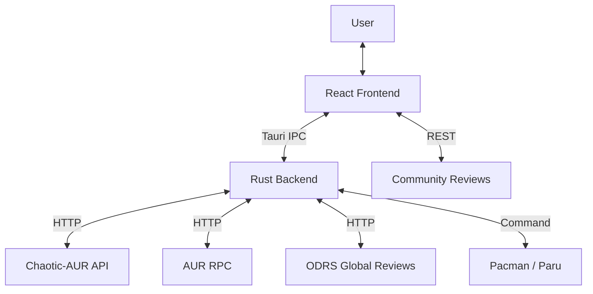

# System Architecture 🏗️

**Last updated:** 2025-01-29 (v0.3.5-alpha.1)

MonARCH Store is built on **Tauri 2**, with a Rust workspace: **monarch-gui** (user process, read-only ALPM + orchestration) and **monarch-helper** (root via Polkit, ALPM write operations). The frontend is React 19 + TypeScript + Tailwind CSS 4 + Vite 7 + Zustand.

## High-Level Overview

## Backend (Rust)

### Workspace Layout
- **`src-tauri/monarch-gui/`**: Tauri app (user process). Commands in `commands/`; `helper_client.rs` builds JSON command, writes to temp file, spawns `pkexec monarch-helper <cmd_file_path>`. Read-only ALPM in `alpm_read.rs`; AUR builds (unprivileged makepkg) then Helper installs built packages.
- **`src-tauri/monarch-helper/`**: Privileged binary. Reads command from temp file, runs ALPM transactions (install, uninstall, sysupgrade, sync). Progress/result streamed via stdout; GUI emits `alpm-progress`, `install-complete`, etc.

### Key GUI Modules
- **`lib.rs`**: Registers Tauri commands and plugins.
- **`commands/`**: `package.rs` (install/uninstall), `search.rs`, `update.rs`, `system.rs`, `utils.rs`, `reviews.rs`.
- **`models.rs`**: Shared types (e.g. `Package`). **`metadata.rs`** / **`flathub_api.rs`**: AppStream and Flathub API used for metadata only (icons, descriptions, reviews); we do not add Flatpak runtime or app support. **`odrs_api.rs`**: ODRS ratings. **`repo_manager.rs`**: Repo state and sync. **`error_classifier.rs`**: Classifies install errors for recovery UI.

### Search & Priority Logic
To ensure the best user experience, results are processed through a **Weighted Relevance Sort** (`utils::sort_packages_by_relevance`). This system prioritizes:
1.  **Exact Matches**: `spotify` ranks higher than `spotify-launcher`.
2.  **Source Reliability**: Official/Chaotic > AUR.
3.  **Similarity**: Shorter names (closer to query) rank higher.

**Fallback Chain (Icons & Metadata)**:
If a package is found in a binary repo (e.g. Chaotic), metadata is enriched via a robust fallback chain:
1.  **AppStream (Local Cache)**: Main source for official arch packages.
2.  **Flathub API**: Used for metadata only (icons, descriptions) for AUR packages that lack AppStream data (e.g. `brave-bin`, `spotify`). We do not install or ship Flatpak apps.
3.  **System Heuristics**: Scans `/usr/share/pixmaps` for installed icons.
4.  **Web Fallback**: Fetches Favicons or OpenGraph images from the upstream URL if all else fails.

**Deduplication**: The backend uses **App ID** based merging. If multiple packages map to the same AppStream ID, they are presented as a single entry to avoid UI clutter. This logic resides in `utils::merge_and_deduplicate` for pure unit testing.

### Testing Infrastructure
We employ a "Mock-First" strategies to validate risky system operations:
- **`MockPackageManager`**: Intercepts `pacman` and `makepkg` calls, returning canned success/failure outputs.
- **`MockRepoClient`**: Simulates HTTP responses (timeout, 404, valid DBs) to test resilience without spamming mirrors.

## Frontend (React + TypeScript)

### Review System (Hybrid)
MonArch uses a "Best Effort" review pipeline implemented in `src/services/reviewService.ts`:
1.  **ODRS**: Primary source for official apps. Matches GNOME/KDE's review database.
2.  **Supabase**: Fallback for AUR/Chaotic packages. Community reviews are stored in a managed PostgreSQL instance.

### State Management
- **Zustand**: Handles local UI state (favorites, theme, search filters).
- **Tauri IPC**: Efficiently bridges data from the Rust binary repos to the TS frontend.

## Security & Resilience

### 1. Privilege Escalation
- **Helper path**: Production uses `/usr/lib/monarch-store/monarch-helper` when present so Polkit policy path matches; dev fallback uses target-built binary. Command is passed via a **temp file** (path only in argv) to avoid truncation and "Invalid JSON" errors.
- **Polkit**: Policy `com.monarch.store.policy` and rules in `10-monarch-store.rules` allow passwordless install/update for authorized users (e.g. wheel). Installed via Settings "Install policy" or onboarding. See [Install & Update Audit](INSTALL_UPDATE_AUDIT.md).
- **Soft Disable**: Repos are enabled at the system level once during Onboarding; toggles in Settings only affect UI visibility, requiring no password for repo toggles.

### 2. GPG Keyring & Hardened Health (v0.2.30)
MonARCH Store implements a multi-layer GPG synchronization and health monitoring strategy:
- **Sequential Startup**: The app follows a strict `Initialization -> Health Check -> Startup` flow defined in `App.tsx`. 
- **Permission-Safe Sensors**: Health checks for the keyring (`/etc/pacman.d/gnupg`) now verify directory existence rather than file contents (which are root-only), preventing false positives.
- **AMD-Aware Hardware Detection**: The `utils::is_cpu_v3_compatible` logic is now "ABM-aware," correctly identifying advanced feature sets on AMD CPUs even if specific bitflags like `lzcnt` are reported differently.
- **Unified Auto-Healing**: The "Smart Repair" engine in `repair.rs` unifies Keyring resets, Polkit policies, and Repository synchronization into a single user-authorized transaction.

### 3. Automatic Migration & Initialization
To support existing users, the app includes a mandatory initialization sequence:
1.  **System Initialization**: Checks for essential directories and Polkit policies.
2.  **Health Check**: Runs a broad diagnostic (`check_system_health`) to identify defects before the UI is interactive.
3.  **Silent Repair**: If defects are found, the user is seamlessly routed to the Onboarding/Repair wizard to fix the system once and for all.

## Deployment (CI/CD)
- **GitHub Actions**: Automated pipeline in `.github/workflows/release.yml`.
- **Signing**: Releases are signed and published to GitHub Releases.
- **Package management rules**: Never run `pacman -Sy` alone. Repo installs use `pacman -Syu --needed` in one transaction; system updates use one full upgrade. AUR: unprivileged makepkg, only `pacman -U` is privileged (via Helper). See [AGENTS.md](../AGENTS.md) and [Install & Update Audit](INSTALL_UPDATE_AUDIT.md).

## Security
- **Network**: Strict CSP (Content Security Policy) configured in `tauri.conf.json`.
- **IPC**: Isolated Tauri commands with strict input validation. All system-altering commands require `pkexec`.
