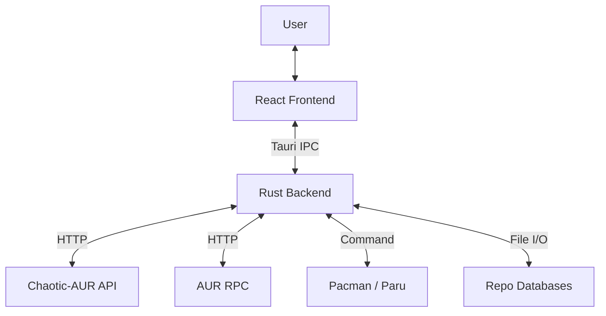

# System Architecture 🏗️

MonARCH Store is built on top of [Tauri](https://tauri.app/), combining a highly performant Rust backend with a modern, reactive frontend.

## High-Level Overview

## Backend (Rust)

The backend handles all heavy lifting, system interactions, and external API communication.

### Key Modules

- **`lib.rs`**: The main entry point for the library, defining the `generate_handler!` macro and registering usage of all Tauri commands.
- **`chaotic_api.rs`**: A specialized client for interacting with the Chaotic-AUR infrastructure.
    - Handles fetching the massive list of pre-built packages.
    - Implements caching strategies (LRU) to minimize network overhead.
    - **Optimization**: Uses batch fetching (`get_packages_batch`) to retrieve metadata for multiple packages in a single request, solving the N+1 query problem.
- **`aur_api.rs`**: Client for the Arch User Repository (AUR) RPC interface.
- **`repo_manager.rs`**: Manages the local synchronization of Pacman databases (Core, Extra, Multilib, CachyOS, etc.). It parses ALPM (Arch Linux Package Management) DB format to provide "Official" package data.
- **`metadata.rs`**: Handles AppStream data (extracted from `appstream-data` package) to provide rich metadata (icons, descriptions, categories) for official packages.
- **`models.rs`**: Shared structs and types, specifically the `Package` struct which unifies data from all sources (Official, Chaotic, AUR) into a single format for the frontend.

### Data Flow

1.  **Startup**: The app initializes, synchronizes Repo DBs in the background, and pre-fetches the Chaotic-AUR package list.
2.  **Search**:
    *   Queries AppStream for "pretty" app names and icons.
    *   Queries Local Repo DBs for binary availability.
    *   Queries Chaotic-AUR cache for pre-built binaries.
    *   Queries AUR RPC for community packages.
    *   Merges and sorts results by relevance (Official > Chaotic > AUR).
3.  **Installation**:
    *   Frontend sends `install_package` command.
    *   Backend determines the source.
    *   If **Official/Chaotic**: Uses `pkexec pacman -S` (native polkit prompt).
    *   If **AUR**: Detects helper (`paru`, `yay`, `aura`) and executes wrapper command.

## Frontend (React + TypeScript)

The frontend is a Single Page Application (SPA) built with Vite.

### Tech Stack
- **Framework**: React 18
- **Styling**: Tailwind CSS (with custom "glassmorphism" utilities)
- **Icons**: Lucide React
- **State**: React Hooks (local) + Tauri Event System (global)

### Key Components

- **`App.tsx`**: Main router and layout manager. Handles the global search bar and sidebar navigation.
- **`CategoryView.tsx`**: Displays grids of applications.
    - Implements **Batch Fetching**: Collects all packages to be rendered and requests their detailed metadata in one go from the backend.
- **`PackageDetails.tsx`**: The "App Store" page for a single item. Shows screenshots, reviews, and install controls.
- **`TrendingSection.tsx`**: Displays "Essentials" and "Trending" lists.
- **`PackageCard.tsx`**: The atomic unit of the UI.
    - **Optimized**: Uses `loading="lazy"` for icons and smart prop handling to avoid redundant data fetching.

## Performance Considerations

- **IPC Overhead**: We minimize specific small calls across the bridge. Large datasets (like the full Chaotic list) are kept in Rust memory, and only requested subsets are sent to frontend.
- **Caching**:
    - **Chaotic Data**: Cached for 1 hour.
    - **Repo DBs**: Synced smartly (only if older than threshold or manual trigger).
    - **Icons**: Heuristically mapped and cached inverted indices.

## Security

- **Privilege Escalation**: The app **never** runs as root. It requests permissions only when necessary via `pkexec` (standard Polkit) for installation/removal operations.
- **Input Validation**: usage of types in Rust ensures robust handling of package names and versions.
