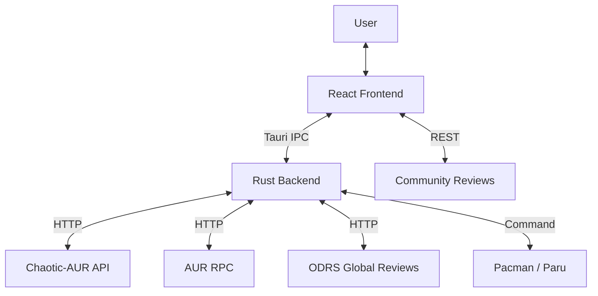

# System Architecture 🏗️

MonARCH Store is built on top of **Tauri v2**, combining a highly performant Rust backend with a modern React frontend.

## High-Level Overview

## Backend (Rust)

### Key Modules
- **`lib.rs`**: Main orchestrator. Handles search, deduplication, and repository prioritization.
- **`models.rs`**: Shared types. Includes the `Package` model used across the app.
- **`flathub_api.rs`**: Critical mapping layer that translates Arch package names to AppStream IDs (e.g., `brave-bin` -> `com.brave.Browser`) for fetching reviews.
- **`odrs_api.rs`**: Fetches global ratings and reviews from the Open Desktop Rating System.
- **`repo_manager.rs`**: Syncs PACMAN databases and manages source-specific logic.

### Search & Priority Logic
To ensure the best user experience, results are merged and sorted by **source reliability and speed**:
1.  **Chaotic-AUR**: Handled first for binary availability.
2.  **Official**: Core/Extra/Multilib.
3.  **Distros**: Manjaro, Garuda, etc.
4.  **AUR**: Absolute fallback.

**Deduplication**: The backend uses **App ID** based merging. If multiple packages map to the same AppStream ID, they are presented as a single entry to avoid UI clutter.

## Frontend (React + TypeScript)

### Review System (Hybrid)
MonArch uses a "Best Effort" review pipeline implemented in `src/services/reviewService.ts`:
1.  **ODRS**: Primary source for official apps. Matches GNOME/KDE's review database.
2.  **Supabase**: Fallback for AUR/Chaotic packages. Community reviews are stored in a managed PostgreSQL instance.

### State Management
- **Zustand**: Handles local UI state (favorites, theme, search filters).
- **Tauri IPC**: Efficiently bridges data from the Rust binary repos to the TS frontend.

## Deployment (CI/CD)
- **GitHub Actions**: Automated pipeline in `.github/workflows/release.yml`.
- **Signing**: Releases are signed with Tauri Updater keys and published to GitHub Releases.
- **Updates**: The app auto-checks the GitHub `latest.json` on launch.

## Security
- **Privilege Escalation**: Uses standard `pkexec` for installers.
- **Network**: Strict CSP (Content Security Policy) configured in `tauri.conf.json`.
